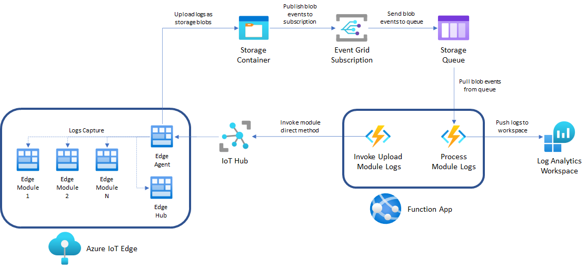
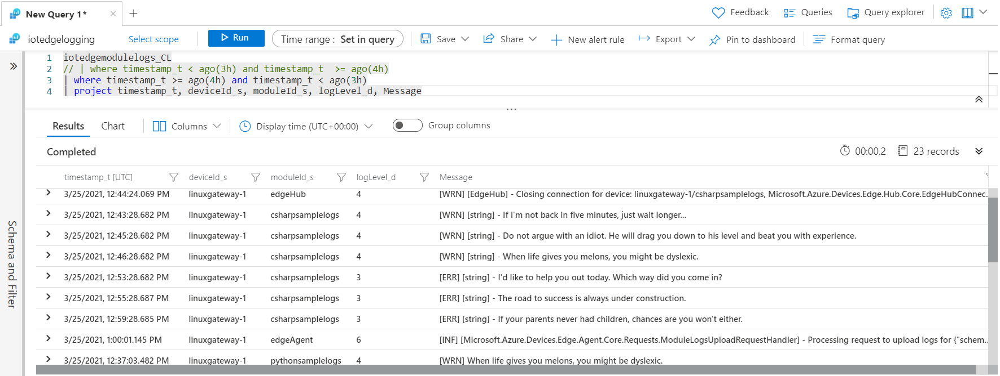

# IoT Edge Logging Solution

Whenever there is an IoT edge device involved, there will be software modules running on it that will generate useful logging data that can help monitor performance and provide feedback to teams, whether they are developers, data engineers, product vendors, etc. The purpose of this article is to provide a solution to capture logs generated by modules at the edge and  store them in Azure Log Analytics, where they can be queried and correlated in multiple ways.


## Architecture reference




## High-level process flow

The architecture reference shown above is designed to be event driven, which means that there won't be services constantly monitoring or moving data unless they have been instructed to. The process is as follows:

1. **InvokeUploadModuleLogs** is an [HTTP triggered](https://docs.microsoft.com/en-us/azure/azure-functions/functions-bindings-http-webhook-trigger?tabs=csharp) Azure Function that invokes the [upload module logs](https://docs.microsoft.com/en-us/azure/iot-edge/how-to-retrieve-iot-edge-logs?view=iotedge-2018-06#upload-module-logs) direct method on the edge agent running on every IoT edge device that matches certain criteria.
2. The edge agent packages the logs for the requested modules and uploads them as blobs to a storage container.
3. The associated storage account is subscribed to an [event grid](https://docs.microsoft.com/en-us/azure/storage/blobs/storage-blob-event-overview) that will send all `create blob` events to a storage queue.
4. **ProcessModuleLogs** is a [storage queue triggered](https://docs.microsoft.com/en-us/azure/azure-functions/functions-bindings-storage-queue) Azure Function that loads log files and sends them to a Log Analytics workspace.


> IMPORTANT: It is key to understand that every IoT edge solution will be unique, as modules running will have different log formats and some teams may be interested in more logs than others. This solution is not meant to be a one-size-fits-all, but as an integration process to be owned, customized and deployed based on the needs of each project or team.


## Pre-requisites

In order to successfully deploy this solution, you will need the following:

- The [.NET Core SDK 3.1](https://www.microsoft.com/net/download)
- The [Azure Functions Core Tools](https://docs.microsoft.com/en-us/azure/azure-functions/functions-run-local#v2) version 3.x.
- [Azure CLI](https://docs.microsoft.com/en-us/cli/azure/install-azure-cli) version 2.4 or later.
- An Azure account with an active subscription. [Create one for free](https://azure.microsoft.com/free/?ref=microsoft.com&utm_source=microsoft.com&utm_medium=docs&utm_campaign=visualstudio).
- A [Function app](https://docs.microsoft.com/en-us/azure/azure-functions/functions-create-function-app-portal#create-a-function-app) in your Azure subscription running **version 3.1 of the .NET runtime stack.** You can host it on a [**Consumption**]([Azure Functions Consumption plan hosting | Microsoft Docs](https://docs.microsoft.com/en-us/azure/azure-functions/consumption-plan)) plan to avoid incurring in unnecessary charges.
- A [Log analytics workspace](https://docs.microsoft.com/en-us/azure/azure-monitor/logs/quick-create-workspace) in your Azure subscription.
- A [storage account](https://docs.microsoft.com/en-us/azure/storage/common/storage-account-create?tabs=azure-portal) in your Azure subscription. It must also have a [container](https://docs.microsoft.com/en-us/azure/storage/blobs/storage-quickstart-blobs-portal#create-a-container) and a [queue](https://docs.microsoft.com/en-us/azure/storage/queues/storage-quickstart-queues-portal).
- A standard [IoT hub](https://docs.microsoft.com/en-us/azure/iot-hub/iot-hub-create-through-portal?view=iotedge-2018-06) in your Azure subscription.
- A [registered IoT Edge device](https://docs.microsoft.com/en-us/azure/iot-edge/how-to-register-device?view=iotedge-2018-06&tabs=azure-portal) in your IoT Hub.
- If you don't have an IoT Edge device running:
  - [Deploy Azure IoT Edge on an Ubuntu virtual machine](https://docs.microsoft.com/en-us/azure/iot-edge/how-to-install-iot-edge-ubuntuvm?view=iotedge-2018-06).
  - [Provision your edge device](https://docs.microsoft.com/en-us/azure/iot-edge/how-to-install-iot-edge?view=iotedge-2018-06#provision-the-device-with-its-cloud-identity) with IoT hub.
  - A [sample IoT edge deployment](EdgeSolution/README.md) to generate logs.


### Prerequisite check

Verify your prerequisites to ensure you have the right versions for Azure CLI and Azure Functions Core Tools:

- In a terminal or command window, run `func --version` to check that the Azure Functions Core Tools are version 3.x.

- Run `az --version` to check that the Azure CLI version is 2.4 or later.
- Run `az login` to sign in to Azure and verify an active subscription.
- Run `dotnet --list-sdks` to check that .NET Core SDK version 3.1.x is installed


### Subscribe the storage account for blob create events

Like it was mentioned before, you will process log files as soon as they are uploaded to your storage account. To react to every uploaded file, you have to link your storage account to  an event grid subscription.

> NOTE: Alternatively, you could change the [ProcessModuleLogs](FunctionApp/FunctionApp/ProcessModuleLogs.cs)  function to use blob triggers instead of leveraging event grid. However, blob trigger relies on polling that works as a hybrid between inspecting logs and running periodic container scans, storage logs are created on a "best effort" basis and therefore there is no guarantee that all events will be captured, missing storage logs as a consequence. Find more information about blob trigger limitations and alternatives [here](https://docs.microsoft.com/en-us/azure/azure-functions/functions-bindings-storage-blob-trigger?tabs=csharp#polling).


Create the event grid subscription using the [az eventgrid event-subscription](https://docs.microsoft.com/en-us/cli/azure/eventgrid/event-subscription?view=azure-cli-latest#az_eventgrid_event_subscription_create) command. Open a PowerShell console and run the code below.

In the following code, replace the storage account, container and queue names with your values:

```powershell
$accountName = "<STORAGE_ACCOUNT_NAME>"
$containerName = "<STORAGE_CONTAINER_NAME"
$queueName = "<STORAGE_QUEUE_NAME>"

$accountId = $(az storage account show --name $accountName --query id -o tsv)
$endpoint = "$($accountId)/queueservices/default/queues/$($queueName)"
$subjectFilter = "/blobServices/default/containers/$($containerName)/"

az eventgrid event-subscription create `
	--name ModuleLogsSubscription `
	--source-resource-id $accountId `
	--endpoint-type storagequeue `
	--endpoint $endpoint `
	--event-delivery-schema eventgridschema `
	--included-event-types "Microsoft.Storage.BlobCreated" `
	--subject-begins-with $subjectFilter
```


## Get the code

Clone the repository:

```bash
git clone https://github.com/marvin-garcia/IoTEdgeLogging.git
```


## Deploy Function App

Now you will deploy the Function app project using the [func azure functionapp publish](https://docs.microsoft.com/en-us/azure/azure-functions/functions-run-local#project-file-deployment) command.

In the following code, replace <APP_NAME> with the name of your app.

```bash
cd IoTEdgeLogging/FunctionApp/
func azure functionapp publish <APP_NAME>
```


The publish command shows results similar to the following output (truncated for simplicity):

```
...

Getting site publishing info...
Creating archive for current directory...
Deployment completed successfully.

...

Functions in <APP_NAME>:
    InvokeUploadModuleLogs - [timerTrigger]

    ProcessModuleLogs - [queueTrigger]
```


## Understanding required application settings

The function solution receives its configuration through the application settings, these settings determine how your function will handle logs. Let's take a look at them:

- **HubConnectionString**: IoT Hub access policy connection string with at least **registry read** and **service connect** permissions. More info about IoT access security can be found [here](https://docs.microsoft.com/en-us/azure/iot-hub/iot-hub-devguide-security).
- **DeviceQuery**: IoT Hub query based on device twin information to target one or many IoT edge devices. It can be something like `SELECT * FROM devices WHERE tags.location.region='US'` to target devices that match certain tags in their device twin. More info about querying IoT Hub for devices and modules can be found [here](https://docs.microsoft.com/en-us/azure/iot-hub/iot-hub-devguide-query-language#device-and-module-twin-queries).
- **StorageConnectionString**: Connection string for the storage account that will host the container to store logs and queue to publish events.
- **ContainerName**: Container name to upload log files to.
- **QueueName**: Storage queue to publish events to.
- **WorkspaceId**: Log analytics workspace Id. More info on how to retrieve the workspace Id can be found [here](https://www.cloudsma.com/2020/08/log-analytics-keys/).
- **WorkspaceKey**: Log analytics workspace shared key. More info on how to retrieve the shared key can be found [here](https://www.cloudsma.com/2020/08/log-analytics-keys/).
- **LogType**: A name to group logs by in Log analytics. It can be something like `iotedgemodulelogs`.
- **LogsIdRegex**: A regular expression that supplies the IoT edge module name. It can match multiple modules. You can use `.*` if you want to capture logs for all modules running on the IoT edge device. [.NET Regular Expressions](https://docs.microsoft.com/en-us/dotnet/standard/base-types/regular-expressions) format is expected.
- **LogsSince**: Only returns logs since this time, as a duration (1d, 90m, 2 days 3 hours 2 minutes), rfc3339 timestamp, or UNIX timestamp. It is **OPTIONAL**, if not provided, it will attempt to retrieve all logs.
- **LogsLogLevel**: Despite what the [official documentation](https://docs.microsoft.com/en-us/azure/iot-edge/how-to-retrieve-iot-edge-logs?view=iotedge-2018-06#upload-module-logs) says for the edge agent's direct methods, this setting filters log lines that match exactly the log level, following the [Syslog severity level]([Syslog - Wikipedia](https://en.wikipedia.org/wiki/Syslog#Severity_level)) standard. It is **OPTIONAL**, if not provided, it will retrieve logs for all log levels.
- **LogsRegex**: Used to filter log lines with content that matches the specified regular expression. [.NET Regular Expressions](https://docs.microsoft.com/en-us/dotnet/standard/base-types/regular-expressions) format is expected. **OPTIONAL**.
- **LogsTail**: Number of log lines in the past to retrieve starting from the latest. **OPTIONAL**.


### Considerations

Now that you have seen the available configuration options for the solution, let's discuss some important considerations and scenarios:

- The solution receives a single IoT hub access connection string, as a consequence only IoT edge devices within the IoT hub provided will be invoked. If your application involves monitoring multiple IoT hubs, consider deploying this solution for each IoT hub or modify the code to handle a list of IoT hub access connection strings.
- Use the **DeviceQuery** settings wisely to target the IoT edge devices you care about. You may need to implement a device twin tag strategy across your devices to mark them as logging ready.
- All the resources in this solution should be deployed in the same region as the IoT Hub to avoid incurring in ingress/egress traffic and reduce latency.

- [Retrieve log](https://docs.microsoft.com/en-us/azure/iot-edge/how-to-retrieve-iot-edge-logs?view=iotedge-2018-06#recommended-logging-format) methods from the edge agent are tightly coupled with [syslog severity level](https://en.wikipedia.org/wiki/Syslog#Severity_level) standard. For best compatibility with the log retrieval feature, the recommended logging format is `<{Log Level}> {Timestamp} {Message Text}`, where `{Timestamp}` should be formatted as `yyyy-MM-dd hh:mm:ss.fff zzz`, and `{Log Level}` should follow the syslog severity level standard referenced before. Try to keep this in mind when developing your own edge modules. When you don't own or maintain the edge modules, most likely logs will differ and you won't be able to obtain the ideal format. In those cases, you can:

  - Use **LogsLogLevel** to capture exactly the log level you need to retrieve (if it matches the syslog standard) and/or use **LogsRegex** to capture certain patterns in your log lines.
  - Implement your own business logic in the **ProcessModuleLogs** function by casting the retrieved logs with the [`LogAnalyticsLog`](FunctionApp/FunctionApp/Models/Logs.cs#L26) class used in this solution.

- Some applications are very verbose, generating a log of trace and information logs. Although it is good to know that your application is performing well, it is more important to take action when things go wrong and keep costs under control. It order to achieve those goals, you should try to retrieve logs that match `warning` level or higher.

  Assume you have a module with a log output like the one below:

  ```
  <2> 2021-03-25 14:56:09.122 +00:00 [CRIT] Quantity is what you count, quality is what you count on.
  <7> 2021-03-25 14:57:09.162 +00:00 [DBG] If you're not supposed to eat at night, why is there a light bulb in the refrigerator?
  <2> 2021-03-25 14:58:09.171 +00:00 [CRIT] The road to success is always under construction.
  <7> 2021-03-25 14:59:09.213 +00:00 [DBG] I think the worst time to have a heart attack is during a game of charades.
  <4> 2021-03-25 15:00:09.272 +00:00 [WRN] Always remember you're unique, just like everyone else.
  <6> 2021-03-25 15:01:09.292 +00:00 [INF] Quantity is what you count, quality is what you count on.
  <7> 2021-03-25 15:02:09.353 +00:00 [DBG] Experience is a wonderful thing. It enables you to recognise a mistake when you make it again.
  <7> 2021-03-25 15:03:09.413 +00:00 [ERR] The road to success is always under construction.
  <7> 2021-03-25 15:04:09.462 +00:00 [DBG] I don't need a hair stylist, my pillow gives me a new hairstyle every morning.
  <2> 2021-03-25 15:05:09.502 +00:00 [CRIT] I asked God for a bike, but I know God doesn't work that way. So I stole a bike and asked for forgiveness.
  ```

  

  If you the set **LogsLogLevel** to `2`, the solution will only retrieve logs that match the `CRITICAL` level:

  ```
      <2> 2021-03-25 14:56:09.122 +00:00 [CRIT] Quantity is what you count, quality is what you count on.
      <2> 2021-03-25 14:58:09.171 +00:00 [CRIT] The road to success is always under construction.
      <2> 2021-03-25 15:05:09.502 +00:00 [CRIT] I asked God for a bike, but I know God doesn't work that way. So I stole a bike and asked for forgiveness.
  ```

  

  Alternatively, if you the set **LogsRegex** to `\b(WRN?|ERR?|CRIT?|FTL?)\b`, the solution will retrieve the following:

  ```
  <2> 2021-03-25 14:56:09.122 +00:00 [CRIT] Quantity is what you count, quality is what you count on.
  <2> 2021-03-25 14:58:09.171 +00:00 [CRIT] The road to success is always under construction.
  <4> 2021-03-25 15:00:09.272 +00:00 [WRN] Always remember you're unique, just like everyone else.
  <7> 2021-03-25 15:03:09.413 +00:00 [ERR] The road to success is always under construction.
  <2> 2021-03-25 15:05:09.502 +00:00 [CRIT] I asked God for a bike, but I know God doesn't work that way. So I stole a bike and asked for forgiveness.
  ```

  

  > NOTE: If you want to know more about how to standardize your edge modules to generate logs consistently, you can take a look at the [sample IoT edge deployment](EdgeSolution/README.md) section to see use cases for .NET Core and Python 3.x.

  

- The property **LogsSince** determines how far back to get logs, it should be aligned with how often the timer function [InvokeUploadModuleLogs](FunctionApp/FunctionApp/InvokeUploadModuleLogs.cs) runs to avoid having duplicate data or data gaps in Log analytics. If you configured the function to run every hour, then this property should be set to `1h` as well.

  > IMPORTANT: The longer you wait to run the function, the larger the log files will be, the more time it will take to process them and the longer you will have to wait to query those logs in Log analytics. Try to run them every hour or less to have access to useful data within a reasonable timeframe.


## Configure application settings

Now that you have seen the settings and know how you want to configure them for your solution, you can follow this [article](https://docs.microsoft.com/en-us/azure/azure-functions/functions-how-to-use-azure-function-app-settings?tabs=portal) to work with application settings on your Function app to add all the settings above.


## Query data from Log analytics

Once you have deployed and configured your function and it has been running enough time to let the modules to generate logs that match the criteria specified in the configuration settings; you will be able to see logs in Log analytics. Go to your Log analytics resource in the Azure portal, choose Logs from the left menu and run the following sample query:

```sql
iotedgemodulelogs_CL
| where timestamp_t <= ago(2h)
| project timestamp_t, iotHub_s, deviceId_s, moduleId_s, logLevel_d, Message
```


The sample query above will return an output like the image below:



